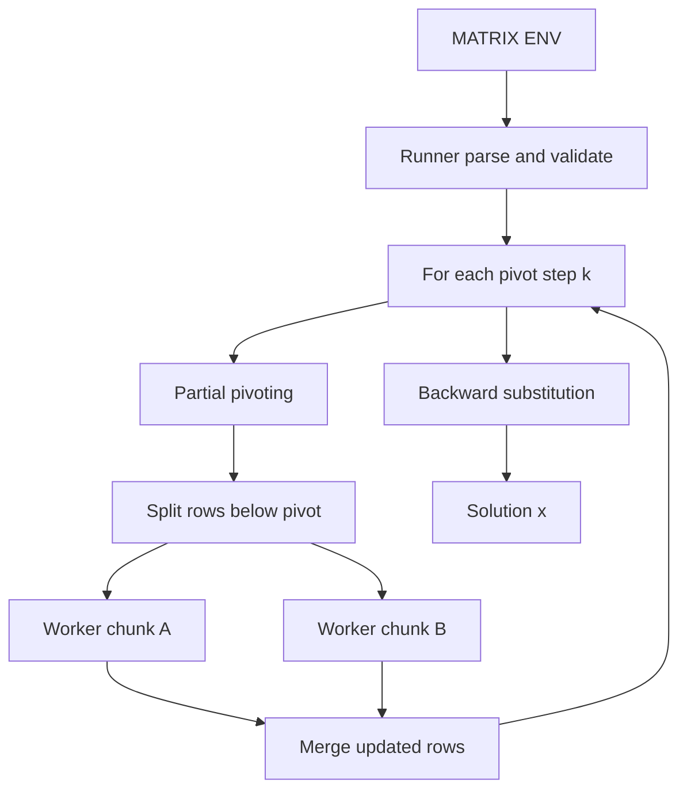

# Як працює алгоритм

## 1) Математична ідея

Розв'язується система `A * x = b` методом Гауса через:
- прямий хід (перетворення в верхньотрикутну матрицю),
- зворотний хід (обчислення змінних від останньої до першої).

У коді використовується розширена матриця `[A|b]`.

## 2) Ролі в PARCS

- `gauss-runner`:
  - читає `MATRIX` і `NUM_WORKERS`,
  - керує кроками елімінації,
  - запускає worker-ів через PARCS `Start(...)`,
  - збирає результати,
  - виконує зворотний хід.

- `gauss-worker`:
  - отримує `pivot row`, `pivot column`, блок рядків,
  - виконує локальну елімінацію для свого блоку,
  - повертає оновлені рядки.

## 3) Послідовність обчислень

На кожному кроці `k` прямого ходу:

1. Runner робить partial pivoting:
   - знаходить рядок з максимальним `|a[i][k]|`,
   - міняє рядки місцями.

2. Runner перевіряє, що pivot не нульовий (поріг `epsilon`).

3. Runner бере всі рядки під pivot (`k+1 ... n-1`) і ділить їх на чанки.

4. Для кожного чанка:
   - запускає worker (`runner.Start(workerImage)`),
   - надсилає `EliminationTask`.

5. Worker для кожного рядка рахує:
   - `factor = row[pivotCol] / pivotRow[pivotCol]`,
   - `row[j] = row[j] - factor * pivotRow[j]` для `j >= pivotCol`.

6. Worker повертає `EliminationResult`.

7. Runner збирає рядки назад у глобальну матрицю і завершує worker-и.

Після цього Runner виконує зворотний хід:
- `x[i] = (b[i] - sum(a[i][j] * x[j])) / a[i][i]` для `i = n-1 ... 0`.

## 4) Де саме відбувається паралелізація

Паралелізація є у фазі **прямого ходу**, тільки для рядків під поточним pivot:

- Runner ділить підматрицю на блоки (`splitRows(...)`).
- Кожен блок обробляється окремим worker-сервісом.
- Worker-и працюють незалежно, бо на кроці `k` кожен рядок оновлюється лише через один і той самий pivot-рядок.

Що лишається послідовним:
- ітерація по `k` (кроки методу),
- partial pivoting,
- зворотний хід.

## 5) Ключові точки в коді

У `gauss-runner/main.go`:
- `forwardEliminationParallel(...)` — керування прямим ходом і запуск worker-ів.
- `splitRows(...)` — балансування рядків між worker-ами.
- `backwardSubstitution(...)` — послідовний фінальний етап.

У `gauss-worker/main.go`:
- `Run()` — прийом задачі і елімінація локального блоку.

## 6) Схема потоку даних

## 7) Практичні нюанси

- Обчислення з `float64`, тому використовується `epsilon = 1e-12`.
- Після елімінації worker обнуляє дуже малі значення (шум floating-point).
- Якщо pivot близький до нуля, розв'язок вважається неможливим або нестійким для цієї матриці.
- Збільшення `NUM_WORKERS` пришвидшує елімінацію лише для достатньо великих матриць; для малих систем накладні витрати на запуск сервісів можуть переважати.
