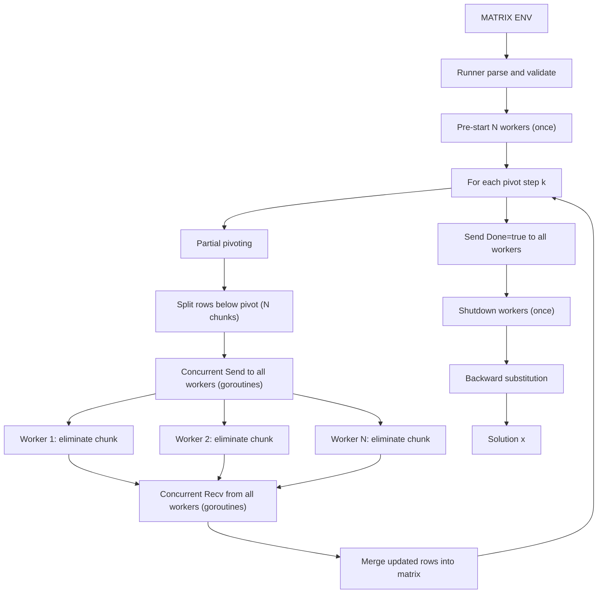

# Як працює алгоритм

## 1) Математична ідея

Розв'язується система `A * x = b` методом Гауса через:
- прямий хід (перетворення в верхньотрикутну матрицю),
- зворотний хід (обчислення змінних від останньої до першої).

У коді використовується розширена матриця `[A|b]`.

## 2) Ролі в PARCS

- `gauss-runner`:
  - читає `MATRIX` і `NUM_WORKERS`,
  - запускає `NUM_WORKERS` довгоживучих worker-сервісів **один раз** перед початком елімінації,
  - керує кроками елімінації (pivot, розбиття рядків, збір результатів),
  - надсилає задачі і отримує результати від worker-ів **конкурентно** через goroutines,
  - після завершення всіх кроків надсилає термінальний сигнал (`Done: true`) кожному worker-у,
  - завершує worker-и (`Shutdown`) **один раз** в кінці,
  - виконує зворотний хід.

- `gauss-worker`:
  - виконує цикл: отримує задачу → обраховує елімінацію для свого блоку рядків → повертає результат,
  - повторює цикл до отримання сигналу `Done: true`,
  - коректно обробляє порожній блок рядків (повертає порожній результат без обчислень).

## 3) Послідовність обчислень

На кожному кроці `k` прямого ходу:

1. Runner робить partial pivoting:
   - знаходить рядок з максимальним `|a[i][k]|`,
   - міняє рядки місцями.

2. Runner перевіряє, що pivot не нульовий (поріг `epsilon`).

3. Runner бере всі рядки під pivot (`k+1 ... n-1`) і ділить їх на `NUM_WORKERS` чанків
   (деякі чанки можуть бути порожніми, якщо рядків менше ніж workers).

4. Runner надсилає `EliminationTask` до **всіх** workers **конкурентно** (goroutines + `sync.WaitGroup`).

5. Кожен worker для кожного рядка у своєму чанку рахує:
   - `factor = row[pivotCol] / pivotRow[pivotCol]`,
   - `row[j] = row[j] - factor * pivotRow[j]` для `j >= pivotCol`.

6. Runner отримує `EliminationResult` від **всіх** workers **конкурентно** (goroutines + `sync.WaitGroup`).

7. Runner записує оновлені рядки назад у матрицю.

Після всіх `n` кроків:
8. Runner надсилає `{Done: true}` кожному worker-у для завершення циклу.
9. Runner викликає `Shutdown` для кожного worker-а (один раз за весь час роботи).

Після цього Runner виконує зворотний хід:
- `x[i] = (b[i] - sum(a[i][j] * x[j])) / a[i][i]` для `i = n-1 ... 0`.

## 4) Де саме відбувається паралелізація

Паралелізація присутня на **двох рівнях**:

### Рівень 1 — PARCS-розподіл (між процесами)
- Runner ділить підматрицю на `NUM_WORKERS` блоків.
- Кожен блок обробляється окремим worker-сервісом незалежно,
  бо на кроці `k` кожен рядок оновлюється лише через один і той самий pivot-рядок.
- Workers — **довгоживучі**: стартують один раз на початку і залишаються активними
  впродовж усіх `n` кроків елімінації (замість O(n × W) запусків контейнерів — O(W)).

### Рівень 2 — goroutine-паралелізм (всередині runner-процесу)
- Надсилання задач до всіх workers відбувається одночасно через goroutines.
- Отримання результатів від всіх workers відбувається одночасно через goroutines.
- Час очікування обмежений `max(latency_i)` замість `sum(latency_i)`.

Що лишається послідовним:
- ітерація по `k` (кроки методу — залежні між собою),
- partial pivoting,
- зворотний хід.

## 5) Ключові точки в коді

У `gauss-runner/main.go`:
- `forwardEliminationParallel(...)` — pre-start workers, керування прямим ходом, concurrent send/recv.
- `splitRows(...)` — балансування рядків між worker-ами (завжди `numWorkers` чанків).
- `backwardSubstitution(...)` — послідовний фінальний етап.

У `gauss-worker/main.go`:
- `Run()` — цикл: recv → eliminate local chunk → send, до `Done: true`.

## 6) Схема потоку даних

## 7) Практичні нюанси

- Обчислення з `float64`, тому використовується `epsilon = 1e-12`.
- Після елімінації worker обнуляє дуже малі значення (шум floating-point).
- Якщо pivot близький до нуля, розв'язок вважається неможливим або нестійким для цієї матриці.
- Збільшення `NUM_WORKERS` пришвидшує елімінацію лише для достатньо великих матриць;
  для малих систем розподіл на порожні чанки додає незначні накладні витрати на JSON-серіалізацію,
  але основна перевага — усунення O(n) повторних запусків контейнерів — зберігається.
- Workers, що отримали порожній чанк на певному кроці, одразу повертають порожній результат
  і переходять до очікування наступної задачі.
